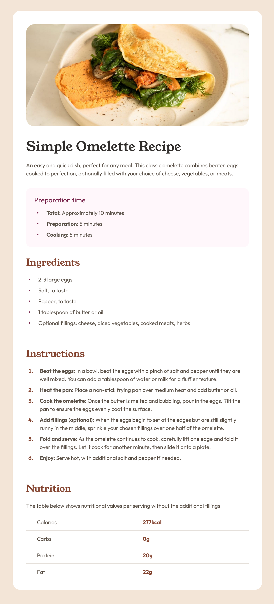

# Frontend Mentor - Recipe page solution

This is a solution to the [Recipe page challenge on Frontend Mentor](https://www.frontendmentor.io/challenges/recipe-page-KiTsR8QQKm). Frontend Mentor challenges help you improve your coding skills by building realistic projects. 

## Table of contents

- [Overview](#overview)
  - [The challenge](#the-challenge)
  - [Screenshot](#screenshot)
  - [Links](#links)
- [My process](#my-process)
  - [Built with](#built-with)
  - [What I learned](#what-i-learned)
- [Author](#author)

## Overview

This challenge is focused on ensuring proper HTML structure including:
- Semantic elements appropriate for the content type
- Using correct heading order (not skipping headings)
- Proper use of the the strong tag for bolded inline text
- Using the table element to display the tabular data including the correct use of header cells and the scope attribute

### The challenge

### Screenshot



### Links

- Solution URL: [FEM solution](https://www.frontendmentor.io/solutions/responsive-recipe-card-component-using-flexbox-and-css-grid-lL8gifcvBV)
- Live Site URL: [live site](https://recipe-page-ruddy-pi.vercel.app/)

## My process

### Built with

- Semantic HTML5 markup
- CSS custom properties
- Flexbox
- CSS Grid
- Mobile-first workflow

### What I learned

After some trial and error attempting a few different approaches, I settled on CSS Grid to achieve the consistent centering of list item text with their associated custom marker dots. I'm certain there are several other potential solutions but I'm happy with the results here.


```css
.ul li {
  display: grid;
  align-items: center;
  grid-template-columns: min-content 1fr;
}

.ul li::before {
  margin-right: var(--spacing-300);
  content: "";
  width: 0.25rem;
  height: 0.25rem;
  border-radius: 50%;
  background: var(--rose-800);
}
```

## Author

- Website - [Matt Pahuta](https://www.mattpahuta.com)
- Frontend Mentor - [@mattpahuta](https://www.frontendmentor.io/profile/MattPahuta)
- Twitter - [@mattpahuta](https://www.twitter.com/MattPahuta)
- LinkedIn - [Matt Pahuta](www.linkedin.com/in/mattpahuta)
